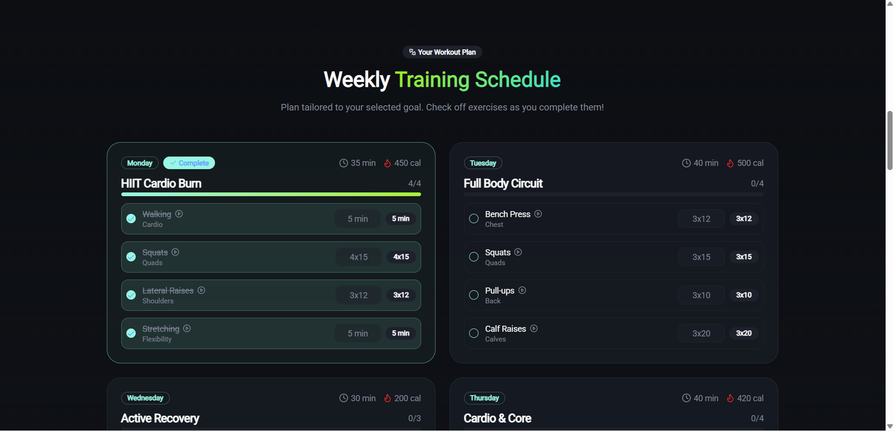
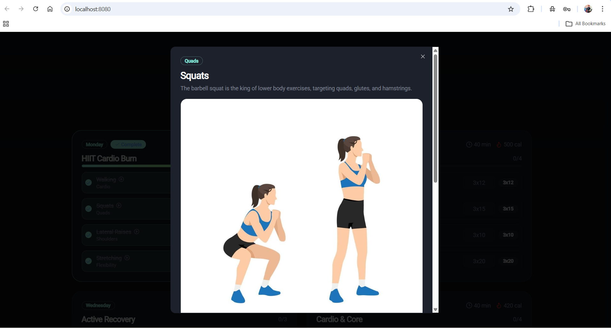
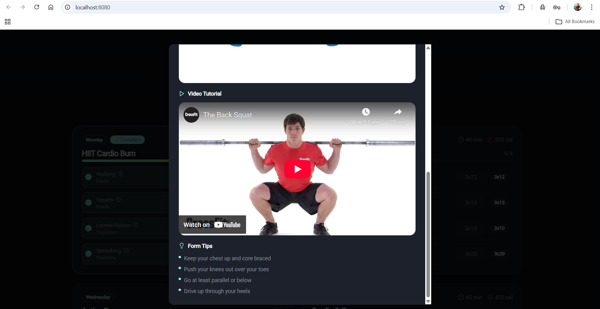
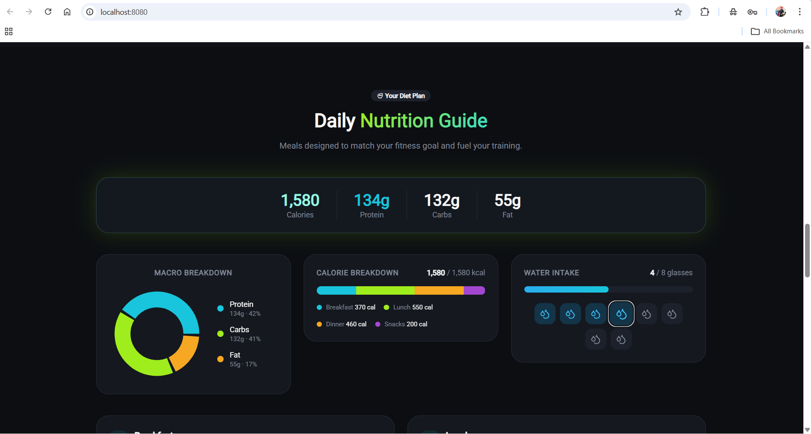
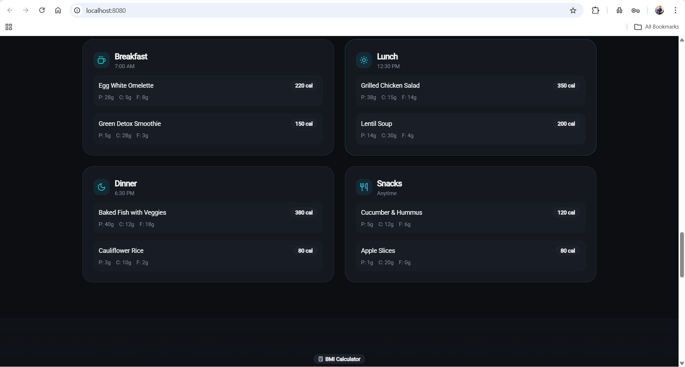
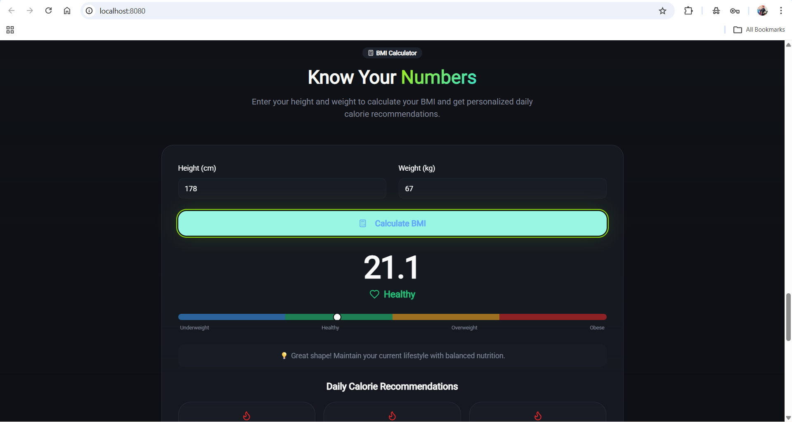
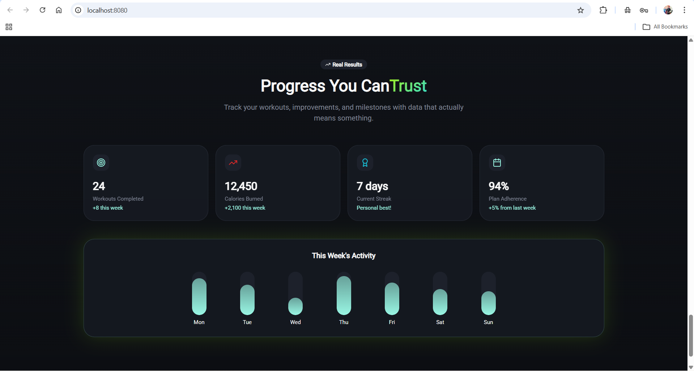

# 🏋️‍♂️ Fitness Tracker

A modern, visually rich **Fitness Tracker web application** built using **React, TypeScript, Vite, Tailwind CSS, and shadcn/ui**.  
The project focuses on clean UI, exercise visualization, and a scalable frontend architecture.

---

## 🔗 About the Project

The Fitness Tracker is designed to help users explore different exercises with visual guidance and form tips.  
It showcases a professional frontend setup using modern tools and follows best practices for maintainability and performance.

This project is ideal as a **portfolio project**, demonstrating:
- Component-based UI design
- Modern styling systems
- Clean folder structure
- Real-world frontend development workflow

---

## ✨ Features

- 🏋️ Exercise cards with images
- 📖 Exercise detail view with form guidance
- 🎥 Embedded workout demo videos
- 🧮 BMI Calculator with health status
- 🌙 Dark fitness-themed UI
- 📱 Fully responsive design
- ⚡ Fast development using Vite
- 🧩 Reusable UI components (shadcn/ui)

---

## 🛠️ Tech Stack

| Technology | Usage |
|----------|-------|
| **React** | UI development |
| **TypeScript** | Type safety |
| **Vite** | Fast build & dev server |
| **Tailwind CSS** | Utility-first styling |
| **shadcn/ui** | Accessible UI components |
| **PostCSS** | CSS processing |

---

## 📸 Screenshots

### 🏠 Home Page


### 🏋️ Exercise Library


### 📋 Exercise Details


### 🎥 Exercise Demo & Tips


### 🧮 BMI Calculator


### 📊 BMI Result & Status


### 🌙 Dark Theme UI


### 📱 Responsive Design


---

## 📁 Project Structure

```bash
fitness-tracker/
├── public/
├── src/
│   ├── assets/              # Exercise images
│   ├── components/          # Reusable UI components
│   ├── data/                # Exercise data
│   ├── App.tsx              # Root component
│   ├── main.tsx             # Entry point
│   └── index.css            # Global styles
├── index.html
├── tailwind.config.ts
├── vite.config.ts
├── package.json
└── tsconfig.json
```

## 🚀 How to Run

1. Clone the Repository
```bash
git clone https://github.com/SudhakarSingh16/fitness-tracker.git
cd fitness-tracker
```
2. Install Dependencies
```bash
npm install
```
3. Start the Development Server
```bash
npm run dev

